# OpenSpider (SpiderAgents) — Architecture

> Generated from GitNexus knowledge graph — 52,013 symbols, 300 execution flows, 80 functional areas.

## Overview

**OpenSpider** is a multi-agent AI platform that orchestrates LLM-powered agents across multiple messaging channels. It provides a web console for management, a pluggable channel system for multi-platform deployment (DingTalk, Feishu, WeChat, Discord, Telegram, and more), and a rich tool/skill ecosystem for agent capabilities including office document processing, browser control, and shell execution.

### Tech Stack

| Layer | Technology |
|-------|-----------|
| Backend | Python 3, FastAPI, SQLAlchemy, Alembic |
| Frontend Console | React, TypeScript, Vite, Zustand |
| Agent Framework | Custom (ACP - Agent Communication Protocol) |
| Messaging | WebSocket, MQTT, Matrix, SIP |
| Database | PostgreSQL (via SQLAlchemy repos) |
| LLM Providers | Pluggable multi-provider (OpenAI, Anthropic, local models) |

## Functional Areas (Top 20 of 80)

| Module | Symbols | Cohesion | Purpose |
|--------|---------|----------|---------|
| **Tools** | 307 | 82% | Agent tool implementations (browser, shell, files, etc.) |
| **Skill System** | 298 | 72% | Office document skills (DOCX, XLSX, PPTX, PDF) with i18n |
| **Validators** | 276 | 73% | Input/output validation and security scanning |
| **CLI** | 246 | 70% | Command-line management interface |
| **Routers** | 236 | 77% | FastAPI route handlers for all API endpoints |
| **Channels** | 149 | 73% | Multi-platform messaging channel adapters |
| **App** | 148 | 73% | Core application bootstrap, agent context, multi-agent manager |
| **Agents** | 136 | 74% | Agent lifecycle, memory, hooks, mission system |
| **DingTalk** | 123 | 73% | DingTalk messaging integration |
| **Providers** | 107 | 71% | LLM provider management and model probing |
| **Office** | 104 | 94% | Office document processing core |
| **ACP** | 75 | 87% | Agent Communication Protocol |
| **Local Models** | 68 | 83% | On-premise LLM integration |
| **Feishu** | 63 | 87% | Feishu/Lark messaging integration |
| **WeChat** | 62 | 70% | WeChat messaging integration |
| **Components** | 57 | 70% | Shared UI components (React) |
| **Matrix** | 52 | 87% | Matrix protocol integration |
| **Skills** | 45 | 87% | Skill loading and execution engine |
| **Runner** | 44 | 74% | Agent runner daemon and control commands |
| **Ops / Backup** | 42 | 77% | Backup/restore and operational utilities |

## High-Level Architecture

```
┌──────────────────────────────────────────────────────────────────────┐
│                        WEB CONSOLE (React/TS)                        │
│  ┌─────────┐  ┌──────────┐  ┌──────────────┐  ┌──────────────────┐ │
│  │  Chat   │  │ Knowledge│  │ Agent Config │  │ File Panel /     │ │
│  │ (WebSocket)│   Base   │  │   (Cards)    │  │ Event Bridge     │ │
│  └────┬────┘  └────┬─────┘  └──────┬───────┘  └────────┬─────────┘ │
│       │            │               │                    │           │
│   Zustand Stores (chatStore, filePanelStore, agentStore, ...)       │
└───────┼────────────┼───────────────┼────────────────────┼───────────┘
        │            │               │                    │
   REST + WebSocket  │               │                    │
        │            │               │                    │
┌───────┴────────────┴───────────────┴────────────────────┴───────────┐
│                     FASTAPI APPLICATION (_app.py)                    │
│                                                                      │
│  ┌──────────────────────────────────────────────────────────────┐   │
│  │                    API ROUTERS (23 routers)                    │   │
│  │  agents │ config │ console │ skills │ providers │ workspace   │   │
│  │  cron │ runner │ mcp │ tools │ messages │ files │ auth       │   │
│  │  settings │ plugins │ backup │ plan │ knowledge │ envs       │   │
│  │  token_usage │ agent_stats │ local_models │ skills_stream   │   │
│  └──────────────────────────┬───────────────────────────────────┘   │
│                             │                                        │
│  ┌──────────────────────────┴───────────────────────────────────┐   │
│  │              MULTI-AGENT MANAGER (core orchestrator)          │   │
│  │  start / stop / reload / preload / lifecycle management       │   │
│  └──┬──────────┬──────────┬──────────┬──────────┬───────────────┘   │
│     │          │          │          │          │                    │
└─────┼──────────┼──────────┼──────────┼──────────┼────────────────────┘
      │          │          │          │          │
      ▼          ▼          ▼          ▼          ▼
┌─────────────────────────────────────────────────────────────────────┐
│                      AGENT RUNTIME LAYER                             │
│                                                                      │
│  ┌──────────┐  ┌──────────┐  ┌───────────┐  ┌──────────────────┐   │
│  │  TOOLS   │  │  SKILLS  │  │  MEMORY   │  │  HOOKS / ACP     │   │
│  │ browser  │  │ docx     │  │ proactive │  │ pre/post hooks   │   │
│  │ shell    │  │ xlsx     │  │ context   │  │ agent comms      │   │
│  │ file_io  │  │ pptx     │  │ episodic  │  │ mission system   │   │
│  │ search   │  │ pdf      │  │           │  │                  │   │
│  │ desktop  │  │ i18n     │  │           │  │                  │   │
│  └──────────┘  └──────────┘  └───────────┘  └──────────────────┘   │
│                                                                      │
│  ┌──────────────────────────────────────────────────────────────┐   │
│  │                   PROVIDERS LAYER                             │   │
│  │  provider_manager │ model probing │ multimodal detection      │   │
│  │  OpenAI │ Anthropic │ Local Models │ Ollama │ ...             │   │
│  └──────────────────────────────────────────────────────────────┘   │
└─────────────────────────────────────────────────────────────────────┘
      │
      ▼
┌─────────────────────────────────────────────────────────────────────┐
│                    MESSAGING CHANNELS (14 channels)                  │
│                                                                      │
│  DingTalk │ Feishu │ WeChat │ Discord │ Telegram │ Matrix │ QQ      │
│  OneBot │ iMessage │ Mattermost │ MQTT │ WeCom │ Voice │ Console   │
│                                                                      │
│  Each channel: bidirectional bridge between agent ↔ messaging platform│
└─────────────────────────────────────────────────────────────────────┘
      │
      ▼
┌─────────────────────────────────────────────────────────────────────┐
│                    INFRASTRUCTURE LAYER                              │
│                                                                      │
│  ┌──────────┐  ┌──────────┐  ┌──────────┐  ┌──────────────────┐   │
│  │    DB    │  │ CONFIG   │  │ SECURITY │  │  KNOWLEDGE BASE  │   │
│  │ SQLAlch  │  │ YAML cfg │  │ skill    │  │  document store  │   │
│  │ repos    │  │ backup   │  │ scanner  │  │  vector search   │   │
│  │          │  │ restore  │  │ tool     │  │                  │   │
│  │          │  │          │  │ guard    │  │                  │   │
│  └──────────┘  └──────────┘  └──────────┘  └──────────────────┘   │
│                                                                      │
│  ┌──────────┐  ┌──────────┐  ┌──────────┐  ┌──────────────────┐   │
│  │  TUNNEL  │  │ WORKSPACE│  │  RUNNER  │  │  MCP SERVER      │   │
│  │ ngrok    │  │ dir mgmt │  │ daemon   │  │  tool exposure   │   │
│  │ expose   │  │          │  │ commands │  │                  │   │
│  └──────────┘  └──────────┘  └──────────┘  └──────────────────┘   │
└─────────────────────────────────────────────────────────────────────┘
```

## Key Execution Flows

### 1. Agent Plan Retrieval (8 steps)
```
get_current_plan → _get_workspace → get_agent_for_request →
get_agent → load_config → _load_and_validate_config →
_remove_bad_field → _remove_nested_key
```
**What happens**: Retrieves the current execution plan for an agent. Resolves the workspace directory, loads the agent instance from the multi-agent manager, loads and validates its configuration, then cleans up bad/nested config keys.

### 2. Agent Configuration Path Rewriting (8 steps)
```
get_current_plan → _get_workspace → get_agent_for_request →
load_config → _load_and_validate_config →
_normalize_working_dir_bound_paths → _walk → _rewrite_path_value
```
**What happens**: Same plan retrieval pipeline, but instead of removing bad keys, it normalizes working-directory-bound paths in the config — walking the config tree and rewriting path values relative to the agent's workspace.

### 3. Skill Config Deletion with Backup (7 steps)
```
delete_skill_config_endpoint → _request_workspace_dir →
get_agent_for_request → get_agent → load_config →
_read_config_data → _backup_config_file
```
**What happens**: When a skill configuration is deleted via API, the system resolves the workspace, loads the agent, reads the current config data, and creates a backup before mutation — ensuring rollback capability.

### 4. Agent Enable/Disable Toggle (7 steps)
```
toggle_agent_enabled → get_agent → load_config →
_load_and_validate_config → _normalize_working_dir_bound_paths →
_walk → _rewrite_path_value
```
**What happens**: Toggling an agent's enabled state triggers a full config reload, validation, path normalization, and rewrite cycle — ensuring the agent's config is consistent after the state change.

### 5. Model Selection & Multimodal Probing (6 steps)
```
set_active_model → maybe_probe_multimodal →
_auto_probe_multimodal → probe_model_multimodal →
get_provider → _normalize_provider_id
```
**What happens**: When a user selects a model, the system triggers optional multimodal probing (checking if the model supports image/audio), resolves the provider, and normalizes the provider ID for consistent internal representation.

### 6. Agent CRUD Operations (6 steps)
```
create_agent / delete_agent → load_config → _load_and_validate_config →
_normalize_working_dir_bound_paths → _walk → _rewrite_path_value
```
**What happens**: Creating or deleting an agent triggers configuration loading, validation, path normalization, and rewriting — ensuring the agent registry stays consistent on disk.

## Data Flow: User Message → Agent Response

```
User Message (Channel)
  │
  ▼
Channel Adapter (DingTalk/Feishu/WeChat/...)
  │  ┌─ normalizes platform-specific format
  │  └─ routes to correct agent
  ▼
MultiAgentManager.get_agent()
  │  ┌─ loads agent if not cached
  │  └─ manages lifecycle (start/stop/reload)
  ▼
Agent Runtime
  │  ┌─ Tool execution (browser, shell, file_io, search)
  │  ├─ Skill invocation (office docs, etc.)
  │  ├─ Memory retrieval (context, episodes)
  │  └─ Hook pipeline (pre/post processing)
  ▼
Provider Layer
  │  ┌─ resolve provider + model
  │  └─ LLM API call (OpenAI/Anthropic/local)
  ▼
Response → Channel → User
```

## Router API Surface

| Router | Domain | Key Operations |
|--------|--------|---------------|
| `agents` | Agent CRUD | create, delete, toggle, list, status |
| `config` | Configuration | get/set config, backup, restore |
| `console` | Web console | WebSocket bridge, file events |
| `skills` / `skills_stream` | Skill management | CRUD, streaming config |
| `providers` | LLM providers | list, set active model, probe |
| `workspace` | File system | directory management |
| `knowledge` | Knowledge base | document CRUD, search |
| `mcp` | MCP protocol | tool exposure |
| `tools` | Agent tools | list, configure |
| `messages` | Chat history | send, list, delete |
| `files` | File management | upload, download |
| `auth` | Authentication | login, token management |
| `cron` | Scheduled tasks | CRUD |
| `runner` | Agent daemon | start, stop, control |
| `plan` | Execution plans | get/set current plan |
| `backup` | Backup/restore | snapshot, restore |
| `plugins` | Plugin system | list, enable/disable |
| `settings` | App settings | global preferences |
| `envs` | Environment vars | get/set |
| `token_usage` | Usage tracking | query, aggregate |
| `agent_stats` | Analytics | agent metrics |

## Channel Ecosystem

The platform supports **14 messaging channels**, each implementing a consistent adapter interface that bridges between the agent runtime and the external platform:

- **Enterprise IM**: DingTalk, Feishu/Lark, WeCom (WeChat Work)
- **Consumer IM**: WeChat, Telegram, Discord, QQ
- **Open Protocols**: Matrix, MQTT, OneBot, SIP/Voice
- **Apple**: iMessage
- **Team Chat**: Mattermost
- **Internal**: Console (WebSocket), Xiaoyi

Each channel normalizes platform-specific message formats into a common internal representation, routes messages to the correct agent, and translates agent responses back into platform-native formats.

## Security

- **Skill Scanner** (`security/skill_scanner/`): Static analysis of skill code for security vulnerabilities
- **Tool Guard** (`security/tool_guard/`): Runtime guardians that sandbox tool execution
- **Approval System** (`app/approvals/`): User approval gates for sensitive operations

## Configuration System

The configuration subsystem (`config/`) is the backbone of all state mutations:

- **YAML-based** config files stored per-agent in workspace directories
- **Backup-before-write** pattern: every mutation creates a `.bak` first
- **Validation pipeline**: load → validate → normalize paths → rewrite
- **Path normalization**: ensures working-directory-bound paths stay consistent across environments
- **Legacy migration**: automatic rewriting of legacy key formats (e.g., WeChat)

## Console Frontend

The React/TypeScript web console (`console/`) provides:

- **Chat Interface** (`pages/Chat/`): Real-time WebSocket communication with agents
- **Knowledge Base** (`pages/KnowledgeBase/`): Document management and search
- **Login** (`pages/Login/`): Authentication
- **Agent Config** (`pages/Agent/Config/`): Agent card configuration
- **File Panel** (`components/FilePanel/`): File preview with event bridge for real-time updates
- **State Management**: Zustand stores (`chatStore`, `filePanelStore`, etc.)
- **Language Support**: i18n via LanguageSwitcher

```

---

## Mermaid Architecture Diagram

```mermaid
graph TB
    subgraph Frontend["🖥️ Web Console (React/TS)"]
        Chat["Chat Page<br/>WebSocket"]
        KB["Knowledge Base"]
        AgentConfig["Agent Config"]
        FilePanel["File Panel"]
        Stores["Zustand Stores"]
    end

    subgraph API["🔌 FastAPI Application"]
        direction TB
        Routers["23 API Routers"]
        MAM["Multi-Agent Manager<br/>orchestrator"]
        AgentCtx["Agent Context"]
        Routers --> MAM
        MAM --> AgentCtx
    end

    subgraph Channels["📡 Messaging Channels (14)"]
        Enterprise["DingTalk · Feishu · WeCom"]
        Consumer["WeChat · Telegram · Discord · QQ"]
        Protocols["Matrix · MQTT · OneBot · SIP"]
        Apple["iMessage"]
        Team["Mattermost"]
        Internal["Console · Xiaoyi · Voice"]
    end

    subgraph AgentRuntime["🤖 Agent Runtime"]
        Tools["Tools<br/>browser · shell · file_io · search · desktop"]
        Skills["Skills<br/>docx · xlsx · pptx · pdf (EN/ZH)"]
        Memory["Memory<br/>proactive · episodic · context"]
        Hooks["Hooks & ACP<br/>pre/post · missions"]
        ProviderLayer["Providers<br/>OpenAI · Anthropic · Local · Ollama"]
    end

    subgraph Infrastructure["⚙️ Infrastructure"]
        DB["Database<br/>SQLAlchemy repos"]
        Config["Config System<br/>YAML · backup · validate"]
        Security["Security<br/>skill scanner · tool guard"]
        Knowledge["Knowledge Base<br/>docs · vectors"]
        Workspace["Workspace<br/>dir mgmt"]
        Runner["Runner<br/>daemon · commands"]
        MCPServer["MCP Server<br/>tool exposure"]
        Tunnel["Tunnel<br/>ngrok expose"]
    end

    Frontend -->|"REST + WebSocket"| API
    Channels -->|"messages"| API
    API --> AgentRuntime
    AgentRuntime --> Infrastructure
    Channels <-.->|"bidirectional<br/>platform bridge"| AgentRuntime
    Frontend -.->|"real-time updates"| Channels

    style Frontend fill:#61dafb,color:#000
    style API fill:#009688,color:#fff
    style Channels fill:#e91e63,color:#fff
    style AgentRuntime fill:#ff9800,color:#000
    style Infrastructure fill:#9c27b0,color:#fff
```


