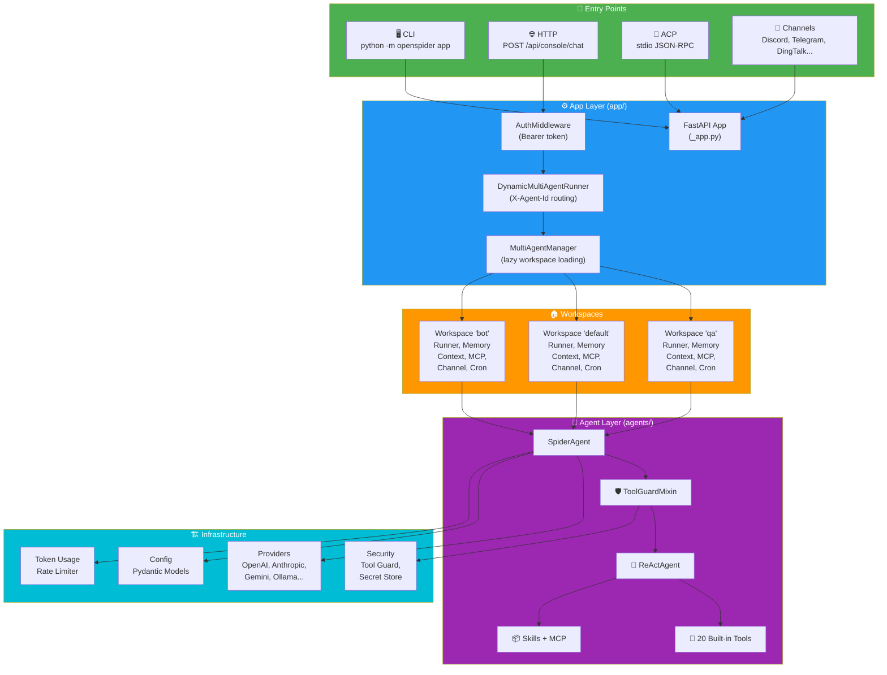

# 01 — Architecture Overview

> High-level system architecture, entry points, request flow, and package map.

---

## System Architecture



---

## Request Flow (End-to-End)

### HTTP Chat Request

```
1. Client POST /api/console/chat { input, session_id, user_id, stream: true }
       │  Headers: Authorization: Bearer <token>, X-Agent-Id: <agent_id>
       ▼
2. AuthMiddleware ──► validates Bearer token
       ▼
3. AgentContextMiddleware ──► extracts agentId → sets contextvar
       ▼
4. DynamicMultiAgentRunner.stream_query(request)
       ▼
5. MultiAgentManager.get_agent(agent_id)
       │  ┌─ Lazy: creates Workspace if not cached
       │  └─ Lock released during slow startup for parallelism
       ▼
6. Workspace.runner.stream_query(request)
       ▼
7. AgentRunner ──► command dispatch
       │  ├─ /daemon approve/deny ──► ApprovalService
       │  ├─ /stop ──► cancel task
       │  ├─ /compact, /new, /clear ──► CommandHandler
       │  ├─ /plan ──► activate plan gate
       │  └─ (default) ──► create SpiderAgent
       ▼
8. SpiderAgent ──► ReAct Loop
       │  ┌─ _reasoning() ──► LLM call (via ToolGuardMixin)
       │  │   └─ ToolGuardMixin intercepts: guard check → approve/deny
       │  ├─ _acting() ──► tool execution
       │  └─ reply() ──► yield SSE events
       ▼
9. SSE stream ← response.body (yielded chunks)
       │  Each chunk: { type: "message", content: [...], metadata: {...} }
       ▼
10. Client renders AgentScopeRuntimeResponseCard
```

### Streaming Mechanisms

| Type | Endpoint | Protocol |
|------|----------|----------|
| Chat streaming | `POST /api/console/chat` (stream: true) | SSE (text/event-stream) |
| Plan streaming | `GET /api/plan/stream` | SSE (persistent fetch, auto-reconnect) |
| Approval polling | `GET /api/console/push-messages` | HTTP polling (2.5s interval) |
| Cancellation | `POST /api/console/chat/stop?chat_id=...` | HTTP POST |

---

## Three-Layer Architecture

| Layer | Package | Responsibility |
|-------|---------|---------------|
| **App Layer** | `app/` | HTTP server, multi-agent routing, channels, workspace lifecycle |
| **Agent Layer** | `agents/` | Agent logic, tools, skills, context, memory, security guard |
| **Infrastructure** | `providers/`, `security/`, `config/`, `token_usage/` | LLM integration, security, configuration, observability |

---

## Package Map

```
src/openspider/
├── __init__.py              # Package init, log level setup, env bootstrap
├── __main__.py              # python -m openspider entry
├── __version__.py           # Version string
├── constant.py              # Central constants, _get_env(), EnvVarLoader
├── exceptions.py            # Domain exceptions
│
├── agents/                  # Agent system (core)
├── app/                     # Application layer (FastAPI, channels, workspace)
├── providers/               # LLM provider abstraction
├── config/                  # Configuration (Pydantic models)
├── cli/                     # CLI (Click-based, 20+ commands)
├── security/                # Security (tool guard, secrets, skill scanner)
├── plan/                    # Plan mode (task decomposition)
├── backup/                  # Atomic backup/restore
├── token_usage/             # Token tracking + persistence
├── tokenizer/               # Token counting
├── local_models/            # Local model management
├── plugins/                 # Plugin system
├── tunnel/                  # ngrok/frp tunneling
├── envs/                    # Persistent env var store
├── agent_stats/             # Agent performance metrics
└── utils/                   # Logging, audit, file utils, telemetry
```

### Key Packages — One-Line Summary

| Package | Purpose |
|---------|---------|
| `agents/` | Core agent: ReActAgent subclass, tool guard, model factory, context, skills, hooks, ACP, mission mode |
| `app/` | FastAPI app, workspace lifecycle, multi-agent manager, channels, runner, approvals, MCP, cron |
| `providers/` | LLM abstraction: OpenAI, Anthropic, Gemini, Ollama, LMStudio, OpenRouter + rate limiter + retry |
| `config/` | Pydantic config models, JSON loading/saving, agent profile config |
| `cli/` | Click-based CLI: `app`, `init`, `doctor`, `daemon`, `channels`, `agents`, `models`, etc. |
| `security/` | Tool-call guarding, skill scanner, encrypted secret store |
| `plan/` | Plan mode: sub-task scheduling, state validation, hint generation, tool-gating |
| `backup/` | Atomic backup/restore with safe-swap for config files |
| `token_usage/` | Token usage tracking, buffered persistence, per-session aggregation |
| `envs/` | Persistent environment variable store (saved/loaded from disk) |
| `local_models/` | Local model manager (llama.cpp, Ollama integration) |
