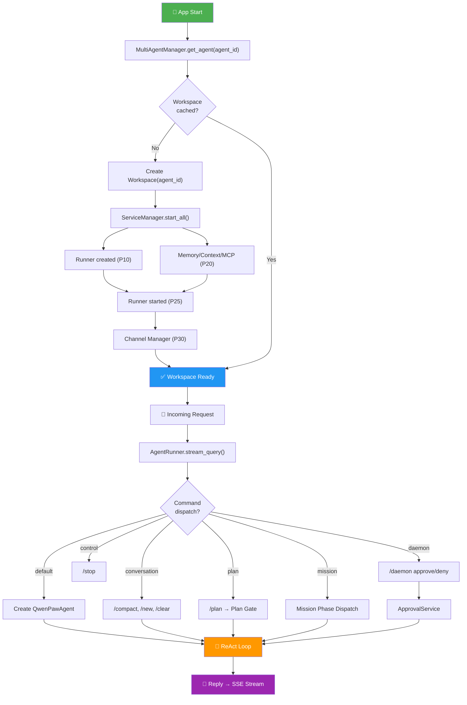
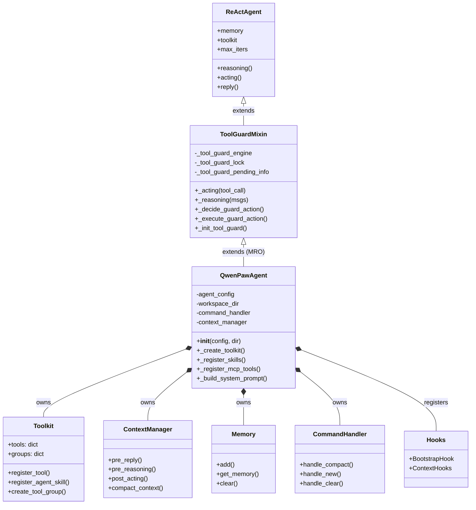
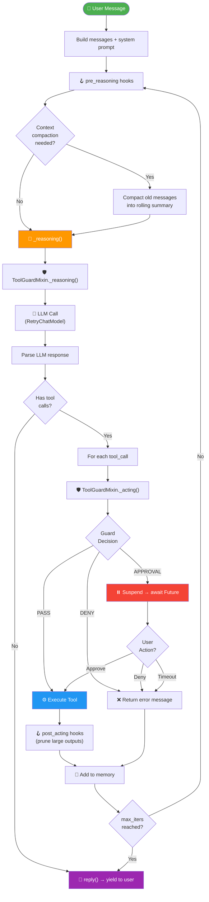
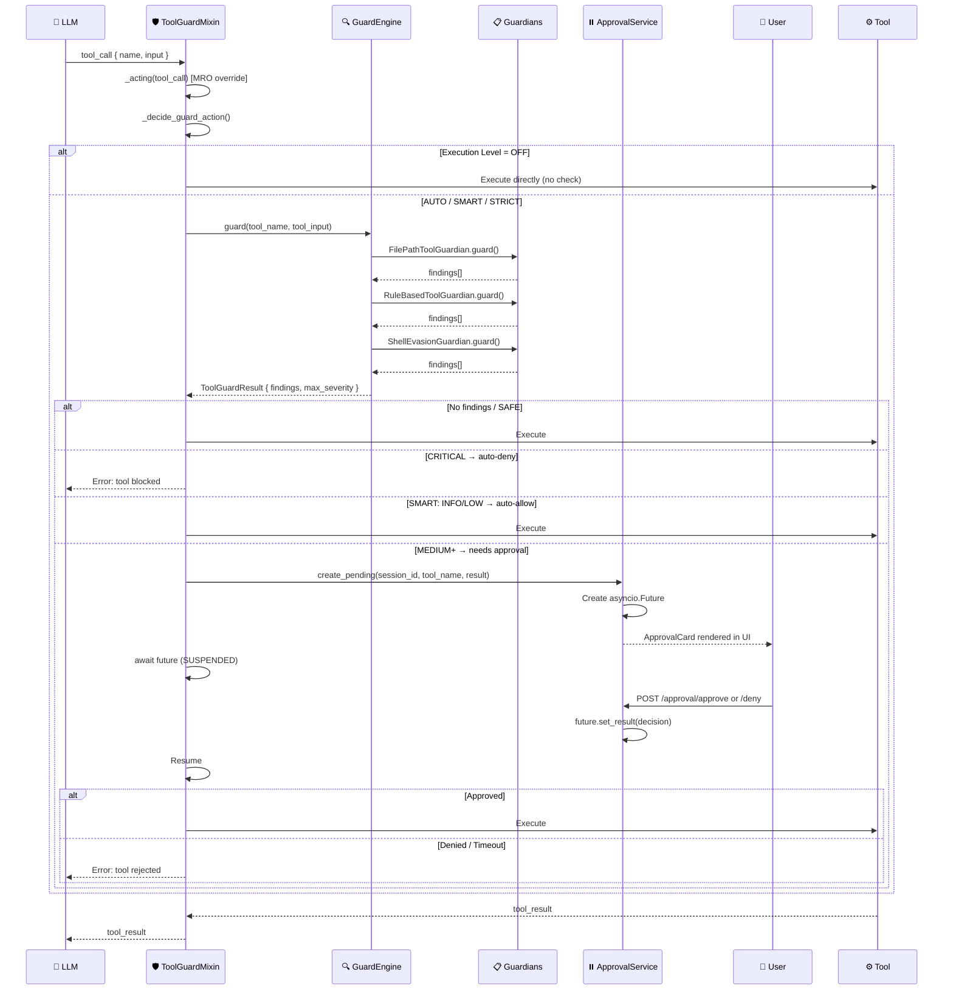

# 02 — Agent System

> Core agent orchestration: QwenPawAgent class, ReAct loop, tool system, security guard, model factory.

---

## Agent Lifecycle (Full Flow)



---

## Class Hierarchy (MRO)



### MRO Design

`ToolGuardMixin` overrides `_acting()` and `_reasoning()` via Python's MRO. Any override in `QwenPawAgent` itself **must** call `super()._acting()` / `super()._reasoning()` to keep the guard interception active.

---

## ReAct Loop (Detailed)



---

## Tool Guard Flow (Security Interception)



---

## Agent Construction

```python
# agents/react_agent.py — QwenPawAgent.__init__()
def __init__(self, agent_config, workspace_dir, ...):
    # 1. Create toolkit with enabled tools from config
    self._create_toolkit(config)
    
    # 2. Register skills from workspace
    self._register_skills()
    
    # 3. Build system prompt from AGENTS.md / SOUL.md / PROFILE.md
    system_prompt = PromptBuilder.build(workspace_dir, language)
    
    # 4. Create model + formatter via factory
    model, formatter = create_model_and_formatter(agent_id)
    
    # 5. Initialize parent ReActAgent
    super().__init__(model, toolkit, memory, formatter, max_iters)
    
    # 6. Register memory tools if memory_manager present
    # 7. Swap memory to AgentContext if context_manager present
    # 8. Setup CommandHandler and lifecycle hooks
```

---

## Lazy Loading Pattern

```python
# agents/__init__.py — module-level lazy loading via __getattr__
def __getattr__(name: str):
    if name == "QwenPawAgent":
        from .react_agent import QwenPawAgent
        return QwenPawAgent
    if name == "create_model_and_formatter":
        from .model_factory import create_model_and_formatter
        return create_model_and_formatter
```

**Purpose**: Prevents importing `agentscope`, all tools, and the full `react_agent` module when CLI commands like `openspider init` or `openspider skills` only need the skill system.

---

## Model Factory

`create_model_and_formatter(agent_id)`:

```
AgentProfileConfig.active_model ──► (provider_id, model_id)
    │
    ▼
ProviderManager.get_chat_model(provider_id, model_id)
    │
    ▼
Provider.create_chat_model() ──► ChatModelBase
    │
    ▼
RetryChatModel(ChatModelBase)          [exponential backoff + rate limiting]
    │
    ▼
TokenRecordingModelWrapper(ChatModel)  [usage tracking]
    │
    ▼
Return (model, formatter) tuple
```

Also handles:
- File:// URL normalization for multimodal inputs
- Provider-specific formatter selection
- `_openspider_force_strip_media` flag for models that don't support multimodal

---

## Tool System

### 20 Built-in Tools

| Tool | File | Supports Async |
|------|------|---------------|
| `execute_shell_command` | `shell.py` | ✅ |
| `read_file` | `file_io.py` | — |
| `write_file` | `file_io.py` | — |
| `edit_file` | `file_io.py` | — |
| `append_file` | `file_io.py` | — |
| `grep_search` | `file_search.py` | — |
| `glob_search` | `file_search.py` | — |
| `browser_use` | `browser_control.py` | — |
| `desktop_screenshot` | `desktop_screenshot.py` | — |
| `view_image` | `view_media.py` | — |
| `view_video` | `view_media.py` | — |
| `send_file_to_user` | `send_file.py` | — |
| `get_current_time` | `get_current_time.py` | — |
| `set_user_timezone` | `get_current_time.py` | — |
| `get_token_usage` | `get_token_usage.py` | — |
| `delegate_external_agent` | `delegate_external_agent.py` | ✅ |
| `list_agents` | `agent_management.py` | — |
| `chat_with_agent` | `agent_management.py` | — |
| `submit_to_agent` | `agent_management.py` | — |
| `check_agent_task` | `agent_management.py` | — |

**Async execution**: Tools with `async_execution=True` get companion tools auto-registered: `view_task`, `wait_task`, `cancel_task`.

### Registration

Each tool is configurable via `AgentProfileConfig.tools.builtin_tools` — each has an `enabled: bool` flag. Plugin-discovered tools are security-gated (must be explicitly configured).

### Namesake Strategy

When a skill or MCP tool name conflicts with a built-in:

| Strategy | Behavior |
|----------|----------|
| `"skip"` | Don't register the conflicting tool (default) |
| `"override"` | Replace built-in with custom |
| `"raise"` | Throw error |
| `"rename"` | Auto-rename with prefix |

---

## Security Guard (ToolGuardMixin)

### Flow

```
Tool call from LLM
    │
    ▼
ToolGuardMixin._acting(tool_call)           [MRO override]
    │
    ▼
_decide_guard_action(tool_call)             [pure read, no lock]
    │
    ├── OFF ──► bypass
    ├── AUTO ──► only check guarded tools
    ├── SMART ──► INFO/LOW auto-allow, MEDIUM+ needs approval
    └── STRICT ──► ALL tools need approval
    │
    ▼
_execute_guard_action(action)               [outside lock]
    │
    ├── None ──► proceed normally
    ├── "auto_denied" ──► block, return error
    └── "needs_approval" ──► ApprovalService.create_pending()
            │
            ▼
        asyncio.Future ──► runner SUSPENDED
            │
            │  User clicks Approve/Deny in UI
            ▼
        ApprovalService.resolve_request(id, APPROVED/DENIED)
            │
            ▼
        Future.set_result() ──► runner RESUMES
```

### Execution Levels

| Level | Behavior |
|-------|----------|
| `OFF` | No guard checks |
| `AUTO` | Only guarded tools checked (backward compatible) |
| `SMART` | INFO/LOW auto-allowed, MEDIUM+ needs approval |
| `STRICT` | ALL tools require approval |

### Concurrent Tool Execution

With `parallel_tool_calls=True`:
- Guard evaluation and execution happen **outside** the `_tool_guard_lock`
- The lock only serializes mutations to shared approval state
- Each tool gets its own `_GuardAction` resolution

### Three Guardians

| Guardian | Checks |
|----------|--------|
| `FilePathToolGuardian` | Sensitive file paths |
| `RuleBasedToolGuardian` | YAML rules (dangerous commands) |
| `ShellEvasionGuardian` | Obfuscation, encoding tricks |

---

## Hooks

### BootstrapHook

On first user interaction:
1. Checks for `BOOTSTRAP.md` in workspace
2. Prepends identity-establishing guidance
3. Sets `.bootstrap_completed` flag

Registered as `pre_reasoning` instance hook.

### Context Manager Hooks

Registered when `context_manager` is present:

| Hook | Trigger |
|------|---------|
| `pre_reply` | Before agent emits final reply |
| `pre_reasoning` | Before reasoning step (compaction check) |
| `post_acting` | After tool execution (prune large outputs) |
| `post_reply` | After reply (cleanup) |

---

## Command Handler

Built-in slash commands processed by `CommandHandler`:

| Command | Action |
|---------|--------|
| `/compact` | Force context compaction |
| `/new` | Start fresh conversation |
| `/clear` | Clear conversation history |
| `/dump_history` | Export conversation to file |
| `/load_history` | Import conversation from file |
| `/stop` | Stop current agent execution |
