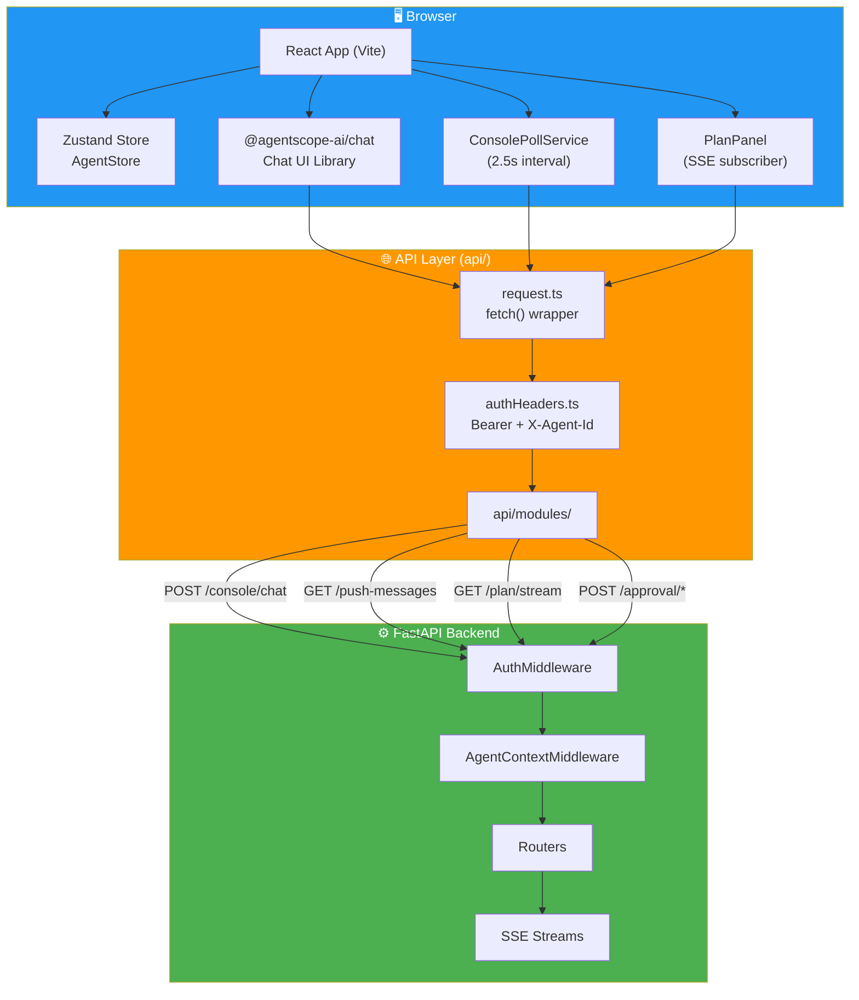

# 11 — Frontend-Backend Connection

> API connection layer, SSE streaming, agent switching, approval UI, state management.

---

## API Architecture Overview



---

## Technology Stack

```
Frontend: React 18 + TypeScript + Vite
    ├── @agentscope-ai/chat ──► Chat UI library (SSE streaming)
    ├── Zustand ──► State management (AgentStore)
    ├── Ant Design ──► UI components
    └── React Router ──► Client-side routing

Backend: FastAPI + Python 3.10+
    └── Serves console static files from console/ build output
```

---

## API Connection Architecture

```
┌─────────────────────────────────────────────────────────┐
│  Frontend (Browser)                                     │
│                                                         │
│  api/request.ts                                         │
│    ├── base URL: VITE_API_BASE_URL + /api               │
│    ├── auth: Bearer token (localStorage)                │
│    └── agent: X-Agent-Id header (sessionStorage)        │
│                                                         │
│  api/modules/                                           │
│    ├── chat.ts ──► POST /console/chat (SSE stream)     │
│    ├── agents.ts ──► GET/POST /agents                   │
│    ├── commands.ts ──► POST /approval/approve|deny      │
│    ├── console.ts ──► GET /console/push-messages        │
│    ├── plan.ts ──► GET /plan/stream (SSE)               │
│    └── provider.ts ──► GET /providers, /models/active   │
└─────────────────────────────────────────────────────────┘
                         │
                         ▼
┌─────────────────────────────────────────────────────────┐
│  Backend (FastAPI)                                      │
│                                                         │
│  AuthMiddleware ──► validates Bearer token              │
│  AgentContextMiddleware ──► extracts X-Agent-Id         │
│                                                         │
│  /api/console/chat ──► SSE stream of agent responses    │
│  /api/console/push-messages ──► approvals + push msgs   │
│  /api/approval/approve ──► resolve pending approval     │
│  /api/approval/deny ──► deny pending approval           │
│  /api/plan/stream ──► plan state SSE updates            │
│  /api/agents ──► CRUD for multi-agent management        │
└─────────────────────────────────────────────────────────┘
```

---

## SSE Streaming

### Chat Streaming

```
POST /api/console/chat { input, session_id, stream: true }
    │
    ▼
Server: text/event-stream response
    │  Each chunk: { type: "message", content: [...], metadata: {...} }
    ▼
@agentscope-ai/chat library:
    ├── Reads ReadableStream from response.body
    ├── Parses each line as JSON (responseParser)
    └── Renders messages incrementally as ResponseCard components
```

### Plan Streaming

```typescript
// Persistent SSE connection with auto-reconnect
function subscribePlanUpdates(onUpdate) {
    const response = await fetch('/api/plan/stream', { headers });
    const reader = response.body.getReader();
    
    while (true) {
        const { done, value } = await reader.read();
        if (done) break;
        // Parse SSE: split on \n, extract data: {...}
        const data = JSON.parse(line.slice(6));
        if (data.type === 'plan_update') {
            onUpdate(data.plan, data.session_id);
        }
    }
    // Auto-reconnect after 3s on error
}
```

### Cancellation

```
POST /api/console/chat/stop?chat_id=...
    → Backend cancels asyncio.Task, sends stop event
```

---

## Agent Store (Zustand)

```typescript
// stores/agentStore.ts
interface AgentStore {
    selectedAgent: string;
    agents: AgentSummary[];
    lastChatIdByAgent: Record<string, string>;
    
    setSelectedAgent(agentId: string): void;
    removeAgent(agentId: string): void;
    setLastChatId(agentId: string, chatId: string): void;
    getLastChatId(agentId: string): string;
}
```

### Dual Storage Strategy

| Storage | What | Purpose |
|---------|------|---------|
| `sessionStorage` | `selectedAgent` | Per-tab isolation |
| `localStorage` | `agents[]`, `lastChatIdByAgent` | Cross-tab shared state |

---

## Agent Switching Flow

```
1. User selects agent in AgentSelector dropdown
       │
2. AgentStore.setSelectedAgent(newAgentId)
       ├── sessionStorage("openspider-agent-storage") = newAgentId
       └── localStorage("openspider-last-used-agent") = newAgentId
       │
3. ChatPage detects selectedAgent change
       ├── Save last chat ID for outgoing agent
       ├── Restore last chat ID for incoming agent
       └── Re-mount AgentScopeRuntimeWebUI with new key
       │
4. All subsequent API calls include:
       X-Agent-Id: <newAgentId>
```

---

## Approval Flow (Frontend)

```
1. ConsolePollService polls GET /api/console/push-messages (every 2.5s)
       │
2. Response: { pending_approvals: [...] }
       │
3. ApprovalContext.setApprovals(pending)
       │
4. ApprovalCard[] rendered (filtered by root_session_id)
       │  Shows: tool name, severity (color-coded), findings, timeout countdown
       │
5. User clicks Approve/Deny
       │
6. POST /api/approval/approve or /deny
       │  { request_id, session_id, reason }
       │
7. Backend: ApprovalService.resolve_request() → Future.set_result()
       │
8. Card removed from UI with exit animation (300ms CSS transition)
```

### ApprovalCard UI Details

- Color-coded severity tag: critical/high=red, medium=yellow
- Collapsible `<details>` for tool parameters
- Copy-to-clipboard for summary and parameters
- Countdown timer from `timeout_seconds`
- "Sub-Agent" tag when `session_id !== root_session_id` (cross-session)

---

## Key API Modules

| Module | File | Endpoints |
|--------|------|-----------|
| `chatApi` | `api/modules/chat.ts` | `POST /console/chat`, `DELETE /chats/:id`, `POST /console/chat/stop` |
| `agentsApi` | `api/modules/agents.ts` | `GET/POST /agents`, `GET/PUT/DELETE /agents/:id` |
| `commandsApi` | `api/modules/commands.ts` | `POST /approval/approve`, `POST /approval/deny` |
| `consoleApi` | `api/modules/console.ts` | `GET /console/push-messages` |
| `planApi` | `api/modules/plan.ts` | `GET /plan/current`, `GET /plan/stream` (SSE) |
| `providerApi` | `api/modules/provider.ts` | `GET /providers`, `GET /models/active` |

---

## Component Hierarchy

```
App
├── ThemeProvider
│   ├── ApprovalProvider
│   │   └── BrowserRouter
│   │       ├── /login → LoginPage
│   │       └── /* → AuthGuard → MainLayout
│   │           ├── Header
│   │           ├── Sidebar
│   │           │   ├── AgentSelector
│   │           │   └── Menu (navigation)
│   │           └── Content
│   │               ├── ConsolePollService (always mounted)
│   │               └── Routes
│   │                   └── /chat/* → ChatPage
│   │                       ├── AgentScopeRuntimeWebUI
│   │                       ├── ApprovalCard[] (overlay)
│   │                       └── ModelPromptModal
```

---

## Session Management

```typescript
class SessionApi implements IAgentScopeRuntimeWebUISessionAPI {
    async getSessionList()        // GET /api/chats
    async getSession(sessionId)   // GET /api/chats/:id
    async createSession()         // Local timestamp → backend UUID
    async removeSession(id)       // DELETE /api/chats/:id
    
    // Local ↔ Backend UUID resolution
    async waitForRealId(tempId)   // Promise-based resolver
}
```

**Bidirectional URL sync**: `onSessionIdResolved`, `onSessionRemoved`, `onSessionSelected`, `onSessionCreated` callbacks keep URL bar in sync.
