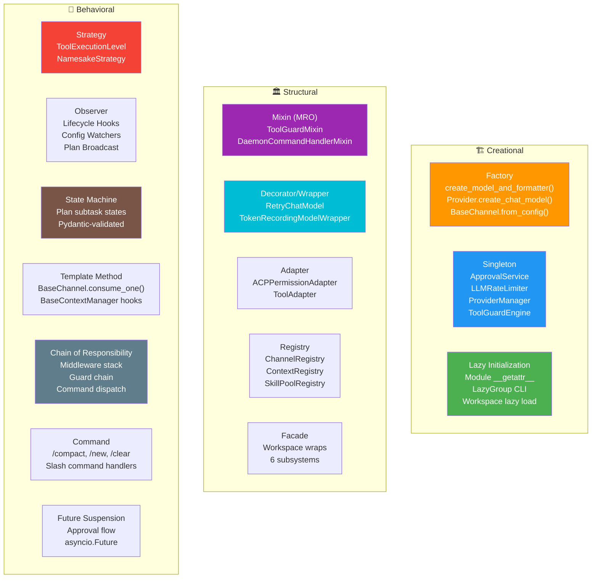
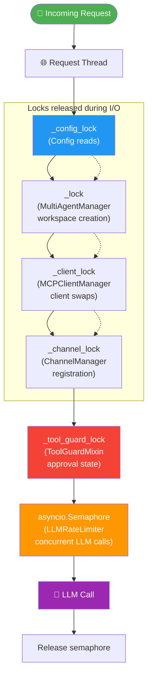
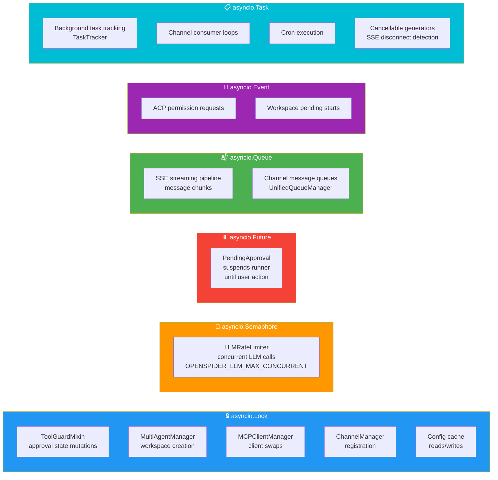
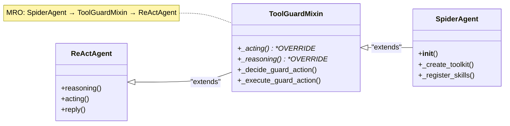
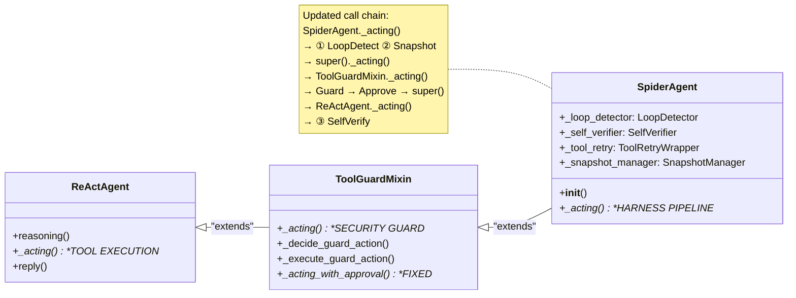
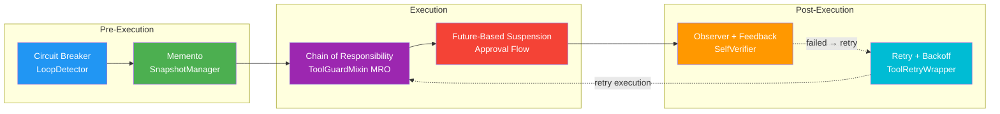

# 14 — Design Patterns Reference

> All design patterns used across the OpenSpider codebase, organized by category.

---

## Pattern Distribution Map



---

## Creational Patterns

### Factory

```python
# Model + Formatter factory
model, formatter = create_model_and_formatter(agent_id)

# Provider model creation
chat_model = provider.create_chat_model()

# Channel from config
channel = BaseChannel.from_config(config)

# Workspace service creation
service = ServiceDescriptor(service_class, init_args, ...)
```

### Singleton

```python
# Global singletons via module-level getter functions
approval_service = get_approval_service()
guard_engine = get_guard_engine()
rate_limiter = LLMRateLimiter.get_instance()
provider_manager = ProviderManager.get_instance()
channel_registry = ChannelRegistry.get_registry()
```

### Lazy Initialization

```python
# Module-level lazy loading (agents/__init__.py)
def __getattr__(name):
    if name == "SpiderAgent":
        from .react_agent import SpiderAgent
        return SpiderAgent

# CLI lazy subcommand loading (cli/main.py)
@click.group(cls=LazyGroup, lazy_subcommands={...})

# Workspace lazy loading (app/)
async def get_agent(agent_id):
    if agent_id not in cache:
        workspace = await create_and_start(agent_id)

# Tool guard lazy init
def _init_tool_guard(self):
    from openspider.security.tool_guard.engine import get_guard_engine
```

---

## Structural Patterns

### Mixin (via MRO)

```python
# Security interceptor in class hierarchy
class SpiderAgent(ToolGuardMixin, ReActAgent):
    # MRO: SpiderAgent → ToolGuardMixin → ReActAgent
    # ToolGuardMixin._acting() intercepts before ReActAgent._acting()
```

Also: `ConversationCommandHandlerMixin`, `DaemonCommandHandlerMixin`.

### Decorator / Wrapper

```python
# Retry wrapper around chat models
model = RetryChatModel(ChatModelBase)

# Token usage wrapper
model = TokenRecordingModelWrapper(model)

# Chain: TokenRecordingModelWrapper(RetryChatModel(ChatModelBase))
```

### Adapter

```python
# ACP permission requests → OpenSpider approval flow
class ACPPermissionAdapter:
    async def request_permission(request) -> ApprovalDecision

# ACP tool calls → AgentScope tool schemas
# tool_adapter.py maps external tool views to internal schemas
```

### Registry

```python
# Context manager registry
@context_registry.register("light")
class LightContextManager(BaseContextManager): ...

# Channel registry
registry = ChannelRegistry.get_registry()
registry.get("discord")  # → DiscordChannel class

# Skill pool registry
pool = SkillPoolRegistry()
```

### Facade

```python
# Workspace wraps multiple subsystems
class Workspace:
    runner: AgentRunner
    memory_manager: BaseMemoryManager
    context_manager: BaseContextManager
    mcp_manager: MCPClientManager
    channel_manager: ChannelManager
    cron_manager: CronManager
    chat_manager: ChatManager
```

---

## Behavioral Patterns

### Strategy

```python
# Tool namesake conflict resolution
NamesakeStrategy = Literal["override", "skip", "raise", "rename"]

# Tool guard execution levels
class ToolExecutionLevel(Enum):
    STRICT = "strict"   # ALL tools need approval
    SMART = "smart"     # INFO/LOW auto-allow
    AUTO = "auto"       # Only guarded tools
    OFF = "off"         # Bypass entirely
```

### Observer

```python
# Lifecycle hooks
agent.register_hook("pre_reasoning", compaction_check)
agent.register_hook("post_acting", prune_large_outputs)

# Config file watchers
MCPConfigWatcher.watch(path, callback)

# Plan state broadcast
broadcast_plan_update(plan, session_id)
```

### State Machine

```python
# Plan subtask states (Pydantic-validated)
SubTaskResponse:
    state: Literal["todo", "in_progress", "done", "abandoned"]
    
    @model_validator
    def validate_state_transition(cls, values):
        # todo → in_progress ✓
        # in_progress → done ✓
        # in_progress → abandoned ✓
        # todo → done ✗ (must go through in_progress)
```

### Template Method

```python
# Channel message processing
class BaseChannel(ABC):
    @abstractmethod
    async def consume_one(self, payload) -> None:
        # Subclasses implement platform-specific logic
    
    async def _consume_one_request(self, payload) -> None:
        # Template: normalize → consume_one → send reply

# Context manager hooks
class BaseContextManager(ABC):
    async def pre_reply(self, agent, msg) -> None: ...  # Template hook
    async def pre_reasoning(self, agent, msgs) -> None: ...
```

### Chain of Responsibility

```python
# Middleware stack
CORSMiddleware → AuthMiddleware → CorrelationIDMiddleware → AgentContextMiddleware

# Guard chain
FilePathToolGuardian → RuleBasedToolGuardian → ShellEvasionGuardian

# Command dispatch
daemon_commands → control_commands → conversation_commands → mission → plan → default
```

### Command

```python
# Slash commands
class CommandHandler:
    "/compact" → compact_context()
    "/new" → new_session()
    "/clear" → clear_history()
    "/stop" → cancel_execution()
```

### Future-based Suspension

```python
# Approval flow suspends runner
future = asyncio.Future()
pending = PendingApproval(request_id, tool_name, future)

# Runner blocks
decision = await future  # Suspended until user action

# User resolves
await approval_service.resolve_request(request_id, APPROVED)
# → future.set_result(APPROVED) → runner resumes
```

---

## Async Patterns

| Pattern | Usage | File |
|---------|-------|------|
| `asyncio.Lock` | Tool guard, approval service, MCP manager, multi-agent manager, channel manager, config cache, rate limiter | Multiple |
| `asyncio.Semaphore` | `LLMRateLimiter` — caps concurrent LLM calls | `providers/rate_limiter.py` |
| `asyncio.Future` | `PendingApproval.future` — suspends runner until user approves | `app/approvals/service.py` |
| `asyncio.Queue` | Streaming message pipeline, channel message queues | `app/runner/`, `app/channels/` |
| `asyncio.Event` | ACP permission requests, workspace pending starts | `agents/acp/`, `app/workspace/` |
| `asyncio.Task` | Background task tracking, channel consumers, cron execution | Multiple |
| Cancellable generators | SSE streaming with client disconnect detection | `app/runner/runner.py` |

### Lock Hierarchy

```
1. _tool_guard_lock        (ToolGuardMixin — serializes approval state mutations)
2. _lock                    (MultiAgentManager — serializes workspace creation)
3. _config_lock             (Config cache — serializes config reads/writes)
4. _client_lock             (MCPClientManager — serializes client swaps)
## Async Lock Hierarchy



**Key rule**: Locks are never held across `await` calls that could block (I/O, network). Long operations release locks and re-acquire.

---

## Async Patterns — Visual Reference



---

### Semaphore Pattern

```python
# Rate limiter: acquire slot before LLM call
async with rate_limiter:
    response = await model(messages)

# Streaming: release slot after first chunk
async for chunk in stream:
    if first_chunk:
        rate_limiter.release()  # Allow next caller
    yield chunk
```

---

## MRO (Method Resolution Order) — Visual



**Call chain**: `SpiderAgent._acting()` → `super()._acting()` → `ToolGuardMixin._acting()` → `super()._acting()` → `ReActAgent._acting()`

---

## Harness Engineering Patterns *(NEW)*

> Added in the Harness Engineering integration. See [16 — Harness Engineering](16-harness-engineering.md) for full documentation.

### Pipeline (Intercepting Filter)

```python
# _acting() executes harness stages in sequence before/after tool execution
async def _acting(self, tool_call):
    # Pre-execution pipeline
    loop_obs = self._loop_detector.check(tool_name, tool_input)   # ① Circuit breaker
    self._loop_detector.record(tool_name, tool_input)             # ② Record
    self._snapshot_manager.snapshot(tool_name, tool_input)        # ③ Memento
    # Execution
    result = await super()._acting(tool_call)                     # ④ Guard → Execute
    # Post-execution pipeline
    verify_obs = await self._self_verifier.verify(...)            # ⑤ Observer feedback
    return result
```

### Circuit Breaker (Loop Detection)

```python
class LoopDetector:
    """Sliding window: if same (tool, args) appears ≥ threshold times,
    inject corrective observation — but never blocks execution."""
    
    _history: deque[tuple[str, str, str]]  # (tool_name, args_hash, result)

    def check(self, tool_name, tool_input) -> str | None:
        if count_matches >= self._threshold:
            return "⚠️ Loop Detected: you are stuck. Try a different approach."
        return None  # Circuit closed — proceed normally
```

### Observer + Feedback Loop (Self-Verification)

```python
class SelfVerifier:
    """Observes tool output, evaluates against expectations,
    feeds corrective signal back to agent memory."""
    
    async def verify(self, tool_name, tool_input, tool_result) -> str | None:
        if tool_name in _FILE_WRITE_TOOLS:
            actual = read_back_file(file_path)
            if expected not in actual:
                return "❌ Self-Verification Failed: content mismatch"
        return None  # No corrective signal needed
```

### Memento / Snapshot (Rollback)

```python
class SnapshotManager:
    """Captures file hashes before mutation; enables rollback on regression."""
    
    def snapshot(self, tool_name, tool_input) -> dict[str, str]:
        # Memento: {file_path: sha256_hash}
        return {str(p): sha256(p) for p in affected_paths}
    
    async def rollback(self, affected_paths) -> dict[str, bool]:
        # Restore: git checkout (preferred) → temp backup (fallback)
        for path, expected_hash in affected_paths.items():
            git_restore(path) or backup_restore(path)
```

### Retry with Exponential Backoff (Tool Retry)

```python
class ToolRetryWrapper:
    """Wraps tool execution with retry on transient errors."""
    
    async def execute(self, tool_name, tool_fn, tool_call_id):
        for attempt in range(self._max_retries + 1):
            try:
                result = await tool_fn()
                if not _is_transient_error(result):
                    return result
                await asyncio.sleep(self._backoff_base * (2 ** attempt))
            except TransientError:
                await asyncio.sleep(self._backoff_base * (2 ** attempt))
        return result  # All retries exhausted

# Usage: result = await wrapper.execute("shell", lambda: run_cmd("ls"), call_id)
```

### Updated MRO with Harness Pipeline



### Pattern Interaction Map


