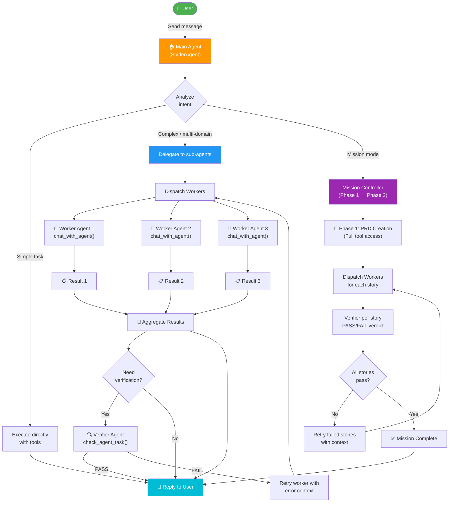
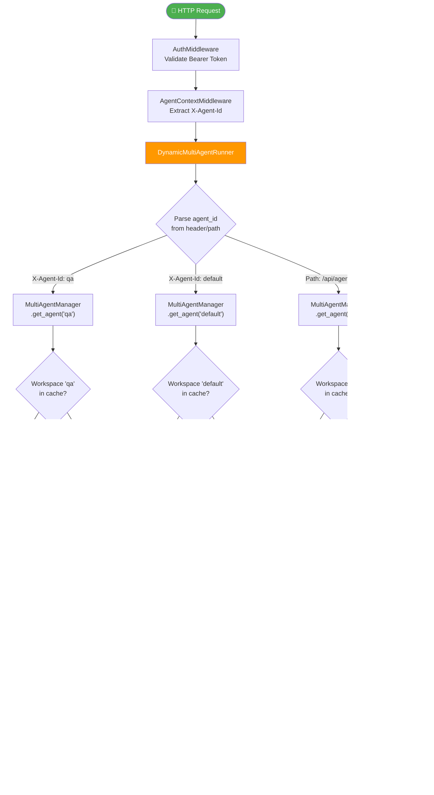
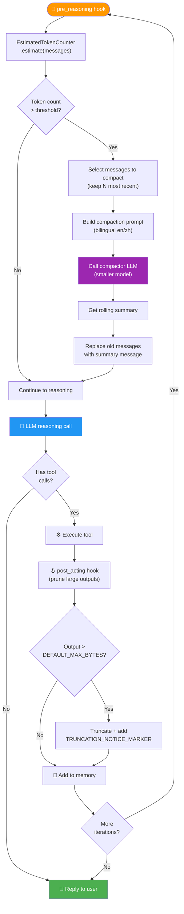
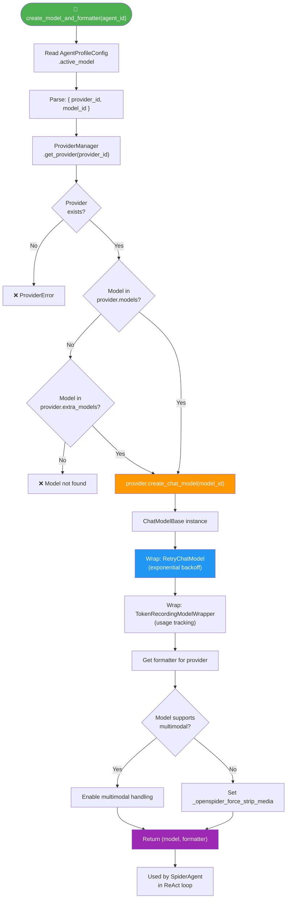
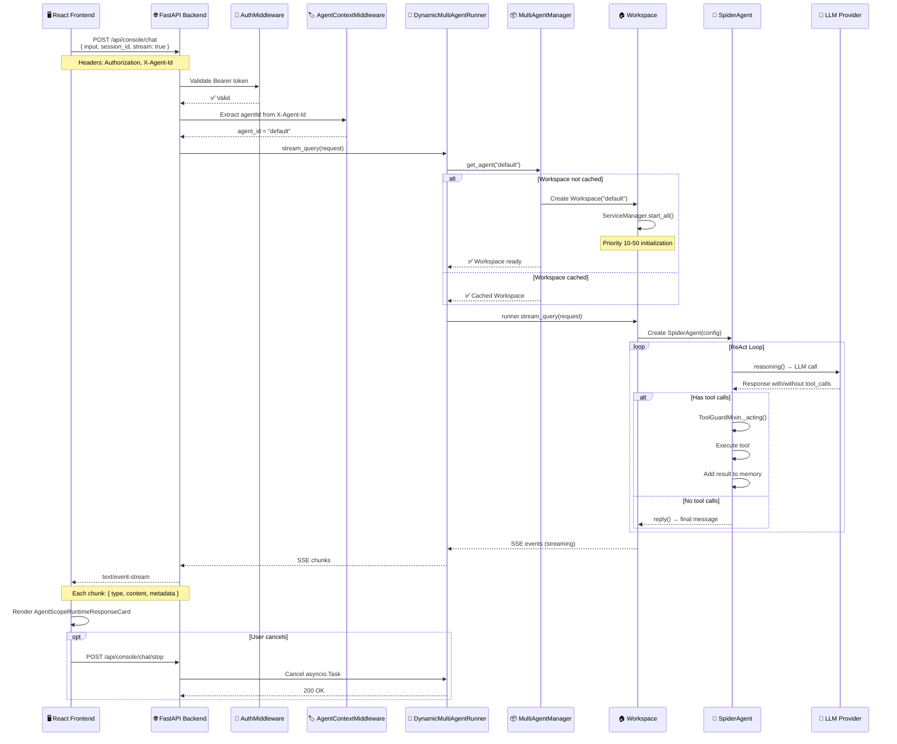
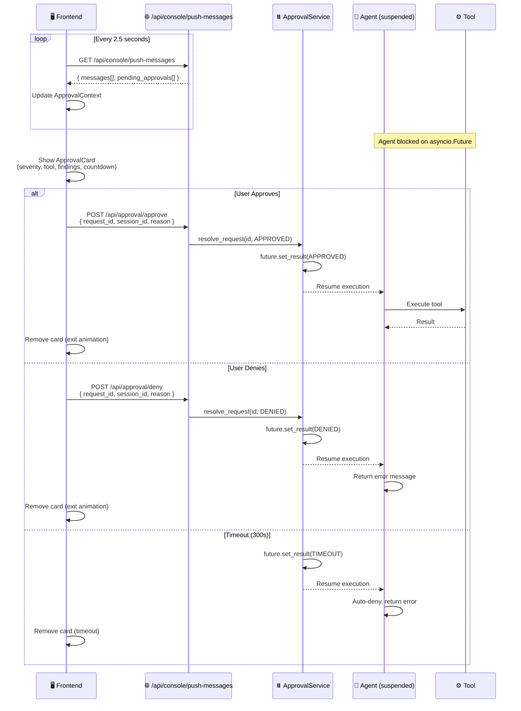
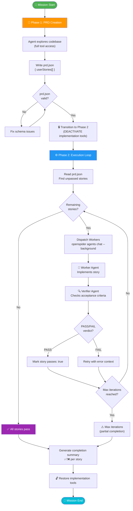
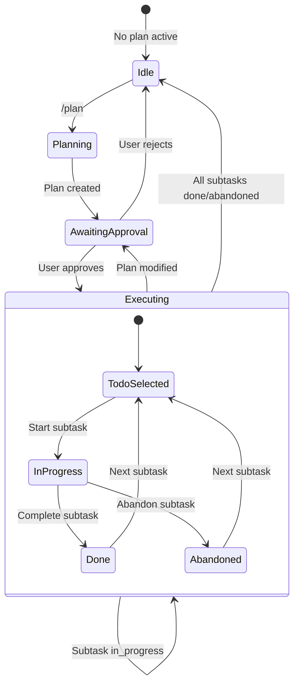

# 15 — Agent Flows & Collaboration Patterns

> Comprehensive Mermaid diagrams covering all agent interaction patterns.

---

## Multi-Agent Collaboration Flow



---

## Tool Auto-Registration Flow

```mermaid
flowchart TD
    START(["🧩 Agent __init__()"]) --> READ_CFG["Read AgentProfileConfig<br/>tools.builtin_tools"]
    READ_CFG --> CREATE_TK["Create Toolkit()"]
    
    CREATE_TK --> REG_BUILTIN["Register Built-in Tools"]
    REG_BUILTIN --> ITER_TOOLS["For each tool in config"]
    ITER_TOOLS --> CHECK_ENABLED{"enabled<br/>in config?"}
    CHECK_ENABLED -->|Yes| ADD_TOOL["toolkit.register_tool(name, func)"]
    CHECK_ENABLED -->|No| SKIP["Skip"]
    ADD_TOOL --> CHECK_ASYNC{"async_execution<br/>enabled?"}
    CHECK_ASYNC -->|Yes| ADD_ASYNC["Register companion tools:<br/>view_task, wait_task, cancel_task"]
    CHECK_ASYNC -->|No| NEXT_TOOL
    ADD_ASYNC --> NEXT_TOOL{"More<br/>tools?"}
    SKIP --> NEXT_TOOL
    NEXT_TOOL -->|Yes| ITER_TOOLS
    NEXT_TOOL -->|No| REG_SKILLS["📦 Register Skills"]
    
    REG_SKILLS --> RESOLVE["resolve_effective_skills(agent_id, channel)"]
    RESOLVE --> ITER_SKILLS["For each active skill"]
    ITER_SKILLS --> LOAD_SKILL["Load SKILL.md + scripts"]
    LOAD_SKILL --> CHECK_NAME{"Name conflict<br/>with built-in?"}
    CHECK_NAME -->|Yes| STRATEGY{"namesake_strategy"}
    STRATEGY -->|"skip"| SKIP_SKILL["Skip skill tool"]
    STRATEGY -->|"override"| OVERRIDE["Replace built-in"]
    STRATEGY -->|"raise"| ERROR["Raise error"]
    STRATEGY -->|"rename"| RENAME["Register with prefix"]
    CHECK_NAME -->|No| REG_SKILL["toolkit.register_agent_skill()"]
    OVERRIDE --> REG_SKILL
    RENAME --> REG_SKILL
    SKIP_SKILL --> NEXT_SKILL
    ERROR --> NEXT_SKILL
    REG_SKILL --> NEXT_SKILL{"More<br/>skills?"}
    NEXT_SKILL -->|Yes| ITER_SKILLS
    NEXT_SKILL -->|No| REG_MCP["🔌 Register MCP Tools"]
    
    REG_MCP --> GET_CLIENTS["MCPClientManager.get_clients()"]
    GET_CLIENTS --> ITER_MCP["For each MCP client"]
    ITER_MCP --> LIST_TOOLS["client.list_tools()"]
    LIST_TOOLS --> REG_MCP_TOOL["toolkit.register_mcp_tool()"]
    REG_MCP_TOOL --> NEXT_MCP{"More<br/>clients?"}
    NEXT_MCP -->|Yes| ITER_MCP
    NEXT_MCP -->|No| REG_PLUGIN["🔌 Register Plugin Tools"]
    
    REG_PLUGIN --> LOAD_PLUGINS["PluginRegistry.get_tools()"]
    LOAD_PLUGINS --> ITER_PLUGIN["For each plugin tool"]
    ITER_PLUGIN --> CHECK_SEC{"Security<br/>gated?"}
    CHECK_SEC -->|Yes| CHECK_CONFIG{"Explicitly<br/>enabled?"}
    CHECK_CONFIG -->|No| SKIP_PLUGIN["Skip"]
    CHECK_CONFIG -->|Yes| ADD_PLUGIN["Register"]
    CHECK_SEC -->|No| ADD_PLUGIN
    ADD_PLUGIN --> NEXT_PLUGIN{"More<br/>plugins?"}
    SKIP_PLUGIN --> NEXT_PLUGIN
    NEXT_PLUGIN -->|Yes| ITER_PLUGIN
    NEXT_PLUGIN -->|No| DONE["✅ Toolkit Ready<br/>(20 built-in + skills + MCP + plugins)"]

    style START fill:#4CAF50,color:#fff
    style DONE fill:#2196F3,color:#fff
    style REG_BUILTIN fill:#FF9800,color:#fff
    style REG_SKILLS fill:#9C27B0,color:#fff
    style REG_MCP fill:#00BCD4,color:#fff
```



---

## Agent Selection & Routing Flow



---

## Context Compaction Loop



---

## Provider Selection & Model Routing



---

## API Connectivity — Request-Response Lifecycle



---

## Approval Polling & Resolution Loop



---

## Mission Mode — Two-Phase Loop



---

## Plan Mode — State Machine



---

## Channel Message Routing

```mermaid
flowchart LR
    subgraph External["🌍 External Platforms"]
        DC["Discord"]
        TG["Telegram"]
        DT["DingTalk"]
        FS["Feishu"]
        QQ["QQ"]
        WECOM["WeCom"]
        WECHAT["WeChat"]
        IM["iMessage"]
        MT["Mattermost"]
        MQTT["MQTT"]
        MATRIX["Matrix"]
        VOICE["Voice/SIP"]
    end
    
    subgraph Channels["📡 Channel Layer"]
        direction TB
        ADAPTERS["Platform-specific<br/>adapters"]
        CM["ChannelManager"]
        QUEUES["UnifiedQueueManager<br/>(asyncio.Queue per channel)"]
        CONSUMERS["Consumer loops<br/>(asyncio.Tasks)"]
    end
    
    subgraph Core["🏠 Core"]
        RUNNER["DynamicMultiAgentRunner"]
        MAM["MultiAgentManager"]
        WS["Workspace → Agent"]
    end
    
    DC --> ADAPTERS
    TG --> ADAPTERS
    DT --> ADAPTERS
    FS --> ADAPTERS
    QQ --> ADAPTERS
    WECOM --> ADAPTERS
    WECHAT --> ADAPTERS
    IM --> ADAPTERS
    MT --> ADAPTERS
    MQTT --> ADAPTERS
    MATRIX --> ADAPTERS
    VOICE --> ADAPTERS
    
    ADAPTERS --> CM
    CM --> QUEUES
    QUEUES --> CONSUMERS
    CONSUMERS --> RUNNER
    RUNNER --> MAM
    MAM --> WS
