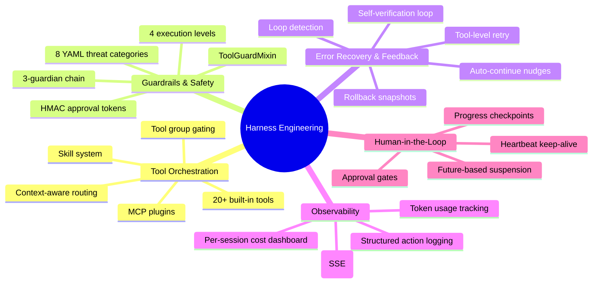
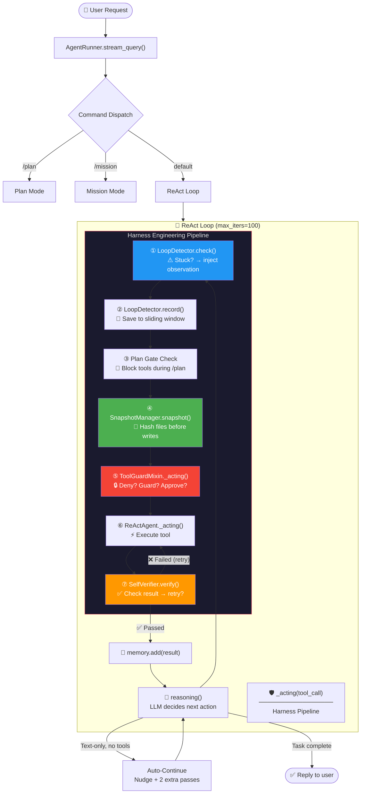
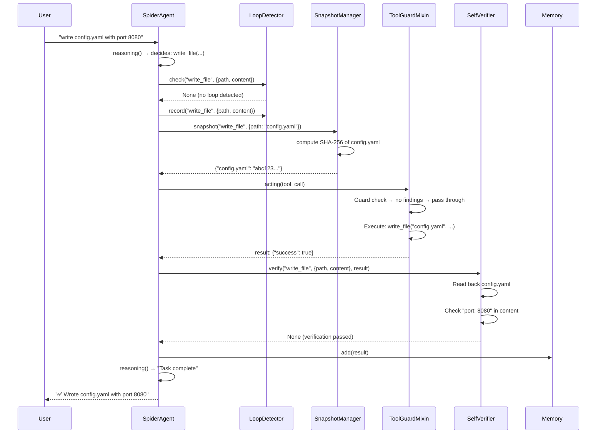

# 16 — Harness Engineering

> **Harness Engineering**: the discipline of designing systems, constraints, and feedback loops that wrap around AI agents to make them reliable in production. A harness is not the agent itself — it is the complete infrastructure that governs how the agent operates.

---

## Table of Contents

1. [What is Harness Engineering?](#what-is-harness-engineering)
2. [The Five Pillars in OpenSpider](#the-five-pillars-in-openspider)
3. [Integrated Harness Pipeline](#integrated-harness-pipeline)
4. [Component Reference](#component-reference)
5. [Architecture Patterns](#architecture-patterns)
6. [Configuration Reference](#configuration-reference)
7. [Testing & Verification](#testing--verification)
8. [Extending the Harness](#extending-the-harness)

---

## What is Harness Engineering?

The term borrows from equestrian equipment: a horse is powerful but without reins, a saddle, and a bridle, it goes wherever it pleases. The AI model is the horse. The harness is everything that channels its power productively.

In OpenSpider, Harness Engineering manifests as **four integrated feedback loops** that wrap the core ReAct agent loop, plus the existing security guardrail system. Together they form a production-grade agent runtime.

### The Problem It Solves

| Without Harness | With Harness |
|---|---|
| Agent repeats the same failed tool call 100 times | Loop detector injects "you are stuck" observation after 3 repeats |
| File writes silently produce wrong content | Self-verifier reads back files and reports mismatches |
| Transient network errors kill tool execution | Tool retry wrapper auto-retries with exponential backoff |
| Destructive changes have no undo | Snapshot manager records pre-state hashes for rollback |
| Agent stops mid-task with text-only response | Auto-continue nudges the agent to keep going (now default ON) |

### Industry Validation

- **LangChain**: +13.7% benchmark improvement (52.8% → 66.5% on Terminal Bench 2.0) by adding self-verification + loop detection — changing only the harness, not the model
- **OpenAI Codex**: 1M+ lines of code with zero human-written lines; 3.5 merged PRs per engineer per day using harness patterns
- **Anthropic**: Effective harnesses for long-running agents across multi-session contexts

---

## The Five Pillars in OpenSpider



### Pillar Mapping to Code

| Pillar | Components | Files |
|--------|-----------|-------|
| **Tool Orchestration** | 20 built-in tools, skill system, MCP clients, tool group gating | `agents/tools/`, `agents/skill_system.py`, `app/mcp/` |
| **Guardrails** | `ToolGuardMixin`, approval service, guard engine, 3 guardians | `agents/tool_guard_mixin.py`, `security/tool_guard/`, `app/approvals/` |
| **Error Recovery** | `LoopDetector`, `SelfVerifier`, `ToolRetryWrapper`, `SnapshotManager` | `agents/loop_detector.py`, `agents/self_verify.py`, `agents/tool_retry.py`, `agents/snapshot.py` |
| **Observability** | Structured action logger, token recording, plan broadcast | `agent_stats/`, `token_usage/`, `plan/broadcast.py` |
| **Human-in-the-Loop** | Approval gates, heartbeat, progress checkpoints | `tool_guard_mixin.py`, `app/approvals/service.py` |

---

## Integrated Harness Pipeline

### The Agent Loop — With Harness



### Data Flow Through Harness Components



---

## Component Reference

### 1. LoopDetector

**Location**: `src/openspider/agents/loop_detector.py`

Detects when an agent is stuck repeating identical tool calls. Uses a sliding window of recent calls and injects a corrective observation when the same (tool_name, args_hash) appears too frequently.

```
Configuration:
  OPENSPIDER_LOOP_DETECTION_ENABLED   = true   (default ON — safe, only adds observations)
  OPENSPIDER_LOOP_DETECTION_WINDOW    = 5      (sliding window size)
  OPENSPIDER_LOOP_DETECTION_THRESHOLD = 3      (repetitions before triggering)
```

**Pattern**: [Circuit Breaker](#circuit-breaker-pattern) — detects failure loops and interrupts them.

**Design**:

```
Sliding Window: [(tool_name, args_hash, result_summary), ...]
        ↓
  check(tool_name, args)
        ↓
  Count matches in window ≥ THRESHOLD?
        ↓ YES                          ↓ NO
  Return observation string       Return None
  "⚠️ Loop Detected: you have     (proceed normally)
   called {tool} with same args
   {count} times..."
```

**Observation format**: Language-aware (en/zh), includes the last 3 result summaries and corrective suggestions.

---

### 2. SelfVerifier

**Location**: `src/openspider/agents/self_verify.py`

After each tool call, verifies the result before committing to memory. Failed verifications feed back as additional observations, giving the LLM a chance to self-correct.

```
Configuration:
  OPENSPIDER_SELF_VERIFY_ENABLED     = false  (opt-in)
  OPENSPIDER_SELF_VERIFY_MAX_RETRIES = 3      (max auto-fix attempts per call)
```

**Verification Strategies**:

| Tool Category | Tools | Verification |
|--------------|-------|-------------|
| File Write | `write_file`, `edit_file`, `append_file` | Read back file; check expected content is a substring of actual |
| Shell | `execute_shell_command`, `execute_python_code` | Check exit_code ≠ 0 or stderr non-empty |
| Search | `grep_search`, `glob_search`, `file_search` | Check result count > 0 |

**Pattern**: [Observer + Feedback Loop](#observer--feedback-loop-pattern) — observes tool output, feeds corrective signal back.

**Retry Logic**:

```
verify(tool_call_id, tool_name, args, result)
  → retry_count[call_id] < max_retries?
      → YES: perform verification
          → Failed? → increment retry_count, return observation
          → Passed? → return None
      → NO: skip (max retries exhausted), return None
```

---

### 3. ToolRetryWrapper

**Location**: `src/openspider/agents/tool_retry.py`

Wraps individual tool executions with automatic retry on transient errors (timeout, connection failure, rate limit). Uses exponential backoff.

```
Configuration:
  OPENSPIDER_TOOL_RETRY_ENABLED      = false  (opt-in)
  OPENSPIDER_TOOL_MAX_RETRIES        = 2      (max retry attempts)
  OPENSPIDER_TOOL_RETRY_BACKOFF_BASE = 0.5    (base delay in seconds)
```

**Pattern**: [Retry with Exponential Backoff](#retry-with-exponential-backoff-pattern) — standard resilience pattern.

**Transient Error Detection**:

Checks both exception types (`TimeoutError`, `ConnectionError`, `RateLimitError`) and result text for keywords: `timeout`, `connection refused`, `temporary failure`, `rate limit`, `service unavailable`, etc.

```
execute(tool_fn, attempt=0):
  try:
    result = await tool_fn()
    if result indicates transient error AND attempt < max_retries:
      wait(backoff_base * 2^attempt)
      return execute(tool_fn, attempt + 1)
    return result
  except TransientError AND attempt < max_retries:
    wait(backoff_base * 2^attempt)
    return execute(tool_fn, attempt + 1)
  except NonRetryableError:
    raise  (propagate immediately)
```

---

### 4. SnapshotManager

**Location**: `src/openspider/agents/snapshot.py`

Records file hashes before destructive tool calls (`write_file`, `edit_file`, `execute_shell_command`). Enables rollback via git restore or temp backup when regression is detected.

```
Configuration:
  OPENSPIDER_SNAPSHOT_ENABLED          = false  (opt-in)
  OPENSPIDER_SNAPSHOT_MAX_BACKUP_SIZE_MB = 50   (max file size to backup)
```

**Pattern**: [Memento / Snapshot](#memento--snapshot-pattern) — captures state before mutation for potential rollback.

**Rollback Strategy** (priority order):

```
rollback({file_path: expected_hash}):
  for each file:
    1. Try git checkout -- <file>        ← preferred (zero storage cost)
    2. Try temp backup restore           ← fallback
    3. Log warning, return False         ← unrecoverable
```

---

### 5. Approval Flow (Fixed)

**Location**: `src/openspider/agents/tool_guard_mixin.py`

The `_acting_with_approval` method was previously commented out (lines 435-520), causing `AttributeError` at runtime for any tool requiring approval. **This is now fixed.**

**Pattern**: [Future-based Suspension](#future-based-suspension-pattern) — suspends the agent's execution until a human resolves the approval.

```
_acting_with_approval(tool_call, tool_name, guard_result):
  1. Cancel any stale pending approvals for this tool call
  2. Create PendingApproval with asyncio.Future
  3. Emit approval request message to user (with approve/deny UI metadata)
  4. Block on Future (with 15s heartbeat keep-alive for SSE)
  5. On resolution:
     - APPROVED → execute tool via super()._acting()
     - DENIED   → return denial message to LLM
     - TIMEOUT  → return timeout message to LLM
```

---

## Architecture Patterns

### Pipeline Pattern

The harness components form a **Pipeline** — a linear sequence of processing stages through which every tool call passes.

```
LoopDetect → Record → PlanGate → Snapshot → Guard → Execute → SelfVerify
     ↓          ↓         ↓         ↓        ↓       ↓         ↓
  Observe    Track     Block     Hash     Deny?   Run      Check
  stuck     history   non-plan   pre-     Guard   tool     result
  pattern   window    tools      state    chain
```

Each stage is independent and can be enabled/disabled via configuration without affecting others.

### Circuit Breaker Pattern

The `LoopDetector` implements a **Circuit Breaker**: it monitors the rate of identical tool calls and "trips" when the threshold is exceeded, injecting a corrective signal. Unlike traditional circuit breakers that block execution, this one *informs* — the agent retains agency to decide how to respond.

```
State transitions:
  CLOSED (normal) → check finds ≥ threshold matches → OPEN (inject observation)
  OPEN → any different tool call → CLOSED (reset)
```

### Observer / Feedback Loop Pattern

The `SelfVerifier` implements an **Observer + Feedback Loop**: it observes the output of each tool call, evaluates it against expectations, and feeds a corrective signal back into the agent's memory. This closes the loop:

```
Agent → Tool → Output → SelfVerifier → Observation → Agent (corrects)
  ↑                                                      |
  └──────────────────────────────────────────────────────┘
```

This is the same pattern that LangChain used to achieve a +13.7% benchmark improvement.

### Memento / Snapshot Pattern

The `SnapshotManager` captures the state of files before mutation (the **Memento**), enabling rollback (the **Restore**). It uses SHA-256 hashes — lightweight, content-addressable, and git-integrated.

```
Originator (Tool) → create Memento (hash) → Caretaker (SnapshotManager)
                                                     ↓
                                               On regression:
                                               restore Memento → Originator
```

### Retry with Exponential Backoff Pattern

The `ToolRetryWrapper` implements classic **Exponential Backoff**: `delay = base × 2^attempt`, with configurable base and cap.

### Future-based Suspension Pattern

The approval flow uses `asyncio.Future` to **suspend** the agent's execution until a human resolves the approval. This is the same pattern used in the existing `ApprovalService` — the harness fix simply restored the orchestration method that ties the components together.

### MRO Chain of Responsibility

The harness leverages Python's **MRO (Method Resolution Order)** to interpose security and harness logic between the agent and the base ReAct loop:

```
SpiderAgent._acting()          ← Harness: LoopDetect, Snapshot, SelfVerify
  → super()._acting()
    → ToolGuardMixin._acting()  ← Security: Guard chain, Approval
      → super()._acting()
        → ReActAgent._acting()  ← Core: Tool execution
```

---

## Configuration Reference

### Environment Variables

All harness configuration uses `OPENSPIDER_*` prefix with `QWENPAW_*` / `COPAW_*` legacy fallback.

| Variable | Type | Default | Description |
|----------|------|---------|-------------|
| `OPENSPIDER_LOOP_DETECTION_ENABLED` | bool | `true` | Enable loop detection (safe default) |
| `OPENSPIDER_LOOP_DETECTION_WINDOW` | int | `5` | Sliding window size for loop detection |
| `OPENSPIDER_LOOP_DETECTION_THRESHOLD` | int | `3` | Repetitions before triggering |
| `OPENSPIDER_SELF_VERIFY_ENABLED` | bool | `false` | Enable self-verification (opt-in) |
| `OPENSPIDER_SELF_VERIFY_MAX_RETRIES` | int | `3` | Max auto-fix attempts per tool call |
| `OPENSPIDER_TOOL_RETRY_ENABLED` | bool | `false` | Enable tool-level retry (opt-in) |
| `OPENSPIDER_TOOL_MAX_RETRIES` | int | `2` | Max retry attempts per tool |
| `OPENSPIDER_TOOL_RETRY_BACKOFF_BASE` | float | `0.5` | Base backoff delay (seconds) |
| `OPENSPIDER_SNAPSHOT_ENABLED` | bool | `false` | Enable file snapshots (opt-in) |
| `OPENSPIDER_SNAPSHOT_MAX_BACKUP_SIZE_MB` | int | `50` | Max file size to backup |

### Agent Config Fields (Pydantic)

In `AgentsRunningConfig` (`src/openspider/config/config.py`):

| Field | Type | Default | Description |
|-------|------|---------|-------------|
| `auto_continue_on_text_only` | bool | **`true`** | Nudge agent when it returns text-only mid-task |
| `max_iters` | int | `100` | Maximum ReAct loop iterations |
| `approval_level` | str | `"AUTO"` | Tool guard execution level |

### Quick Start Configurations

**Maximum safety** (production):
```bash
OPENSPIDER_LOOP_DETECTION_ENABLED=true
OPENSPIDER_SELF_VERIFY_ENABLED=true
OPENSPIDER_SNAPSHOT_ENABLED=true
OPENSPIDER_TOOL_RETRY_ENABLED=true
```

**Maximum performance** (development):
```bash
OPENSPIDER_LOOP_DETECTION_ENABLED=true   # keep this — it's free
# All others default OFF
```

---

## Testing & Verification

### Unit Tests

```bash
# Run all tests
make test-unit

# Run agent-specific tests
python -m pytest tests/unit/agents/ -v --tb=short

# Run with coverage
make coverage-full
```

### Headless CLI Testing

```bash
# Basic harness test
python -m openspider task \
  -i "write test.txt with content 'harness verification'" \
  --no-guard --max-iters 10 --timeout 30

# With all harness features enabled
$env:OPENSPIDER_LOOP_DETECTION_ENABLED = "true"
$env:OPENSPIDER_SELF_VERIFY_ENABLED = "true"
$env:OPENSPIDER_SNAPSHOT_ENABLED = "true"
python -m openspider task -i "create hello.txt" --no-guard
```

### Manual Dev Server Testing

```bash
# Start backend only
python scripts/run_dev.py --no-frontend

# Send requests via API
curl -X POST http://localhost:8000/api/agents/default/chat \
  -H "Content-Type: application/json" \
  -d '{"message": "write a file called test.txt"}'
```

---

## Extending the Harness

### Adding a New Harness Component

1. **Create the module** in `src/openspider/agents/`:
   ```
   src/openspider/agents/my_harness.py
   ```

2. **Implement the component class** with:
   - Constructor accepting `enabled` parameter (default from env var)
   - `enabled` property with getter/setter
   - Async methods as needed

3. **Register env vars** in `src/openspider/constant.py`:
   ```python
   MY_HARNESS_ENABLED = EnvVarLoader.get_bool("OPENSPIDER_MY_HARNESS_ENABLED", False)
   ```

4. **Wire into the pipeline** in `react_agent.py`:
   - Import: `from .my_harness import MyHarness`
   - Init in `__init__`: `self._my_harness = MyHarness()`
   - Call in `_acting`: before or after `super()._acting(tool_call)`

### Adding a New Verification Strategy

Extend `SelfVerifier.verify()` in `src/openspider/agents/self_verify.py`:

```python
# Add tool category
_MY_TOOLS = frozenset({"my_tool", "my_other_tool"})

# Add verification branch in verify()
elif tool_name in _MY_TOOLS:
    verdict = await self._verify_my_tool(tool_input, tool_result)
```

### Adding a New Snapshot Strategy

Extend `SnapshotManager.snapshot()` in `src/openspider/agents/snapshot.py`:

```python
# Add tool to destructive set
_DESTRUCTIVE_TOOLS = frozenset({
    "write_file", "edit_file", "append_file",
    "execute_shell_command",
    "my_destructive_tool",  # ← add here
})
```

---

## Key Files

| File | Purpose |
|------|---------|
| `src/openspider/agents/loop_detector.py` | Sliding-window stuck-detection |
| `src/openspider/agents/self_verify.py` | Post-execution result verification |
| `src/openspider/agents/tool_retry.py` | Tool-level retry with exponential backoff |
| `src/openspider/agents/snapshot.py` | File-hash snapshots for rollback |
| `src/openspider/agents/react_agent.py` | Harness pipeline integration in `_acting()` |
| `src/openspider/agents/tool_guard_mixin.py` | Security guard + fixed approval flow |
| `src/openspider/constant.py` | All `OPENSPIDER_*` harness env vars |
| `src/openspider/config/config.py` | `AgentsRunningConfig` harness fields |

## Related Docs

- [14 — Design Patterns](14-design-patterns.md) — All design patterns in the codebase
- [15 — Agent Flows](15-agent-flows.md) — Agent interaction diagrams
- [10 — Security](10-security.md) — Tool guard engine details
- [09 — Plan & Mission](09-plan-mission.md) — Plan state machine and mission loops
